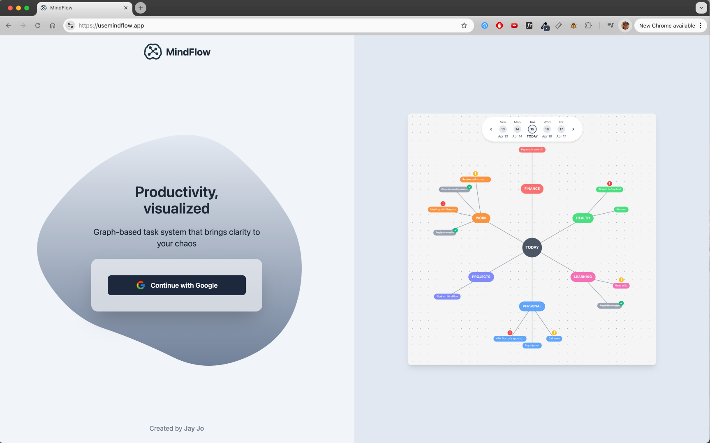
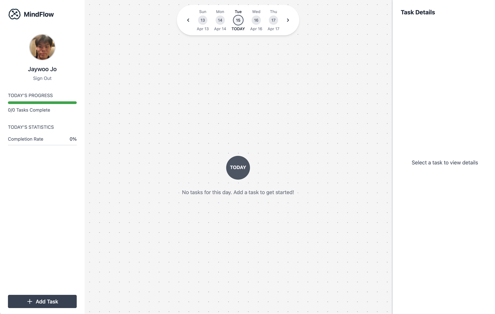
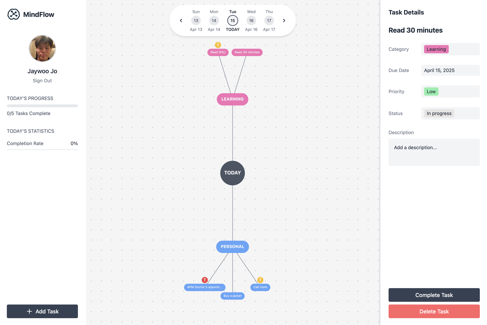
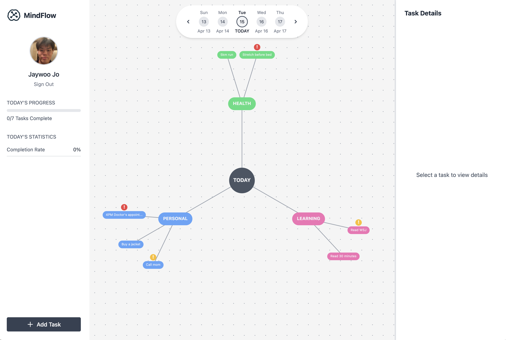
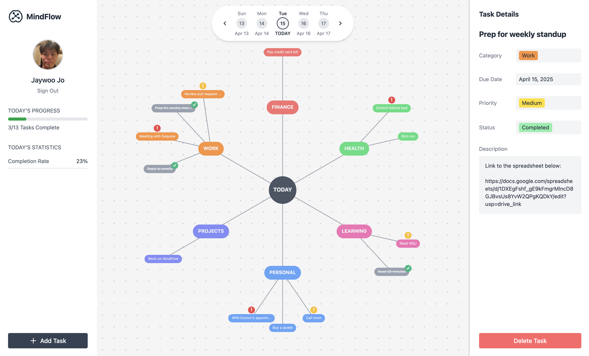

# 🪴 MindFlow 

👉🏼 [usemindflow.app](https://usemindflow.app)  
 
Productivity, Visualized.  
A graph-based task management app that brings clarity to your chaos.  

  

  
  
  
  

## 💡 Overview

MindFlow is a visual productivity app that reimagines task management through an interactive graph.
Instead of linear lists and cluttered boards, MindFlow maps your tasks — making your day visually intuitive and easier to navigate.

I built it out of frustration with traditional to-do apps that bury tasks in endless lists. It was designed for anyone who wants a more intuitive and visual way to bring structure and clarity to their day-to-day. To be frank I'm trying to build the best productivity app out there but there are still a lot of features I'm needing to add.

### Core Features

- Mind Map Visualization – Categories and tasks visualized as an interactive D3.js graph
- Date-Based Navigation – View and plan tasks for past, present, or future days
- Auto-Rollover Tasks – Unfinished tasks automatically move to today
- Dynamic Categories – Create, rename, delete, and recolor categories
- Priority Tags – Visual priority indicators (low / medium / high)
- Task Details + Form – Full CRUD with editable due date, category, and priority
- Daily Stats – Track daily progress and completion rates in the sidebar

### Shopping list of things I want to add...
- [ ] Backend Migration to Node.js + MongoDB
    - Move from Firestore to a scalable backend using Express + MongoDB Atlas.
    - Keep Firebase Auth for login, but route all data through a secure API.
- [ ] Fix my auto-rollover feature where unfinished previous day tasks automatically move to today
- [ ] Implement ability to toggle between different views
    - This would include adding a calendar view and kanban board view.
- [ ] Drag-and-Drop Node Reordering
    - Ability to reposition task nodes with D3 drag behaviour.
- [ ] Recurring Tasks
    - Adding recurrence rules to tasks. (repeating daily, weekly, custom)
- [ ] Custom Views
    - View by priority, category, or time span (e.g., week view)
- [ ] Task Streaks
    - Figure out a way to gamify consistency, perhaps track task streaks for recurring tasks?
- [ ] Google Calendar Integration
- [ ] AI/Smart Features
    - Natural language input for tasks like "meeting with John tomorrow at 3pm" would automaticaly create the task.
- [ ] Mobile Responsiveness 
    - The app is currently optimized for desktop.

## 🛠️ Tech Stack

### Current Stack
- **Frontend:** React, TypeScript, Tailwind CSS, Framer Motion, D3.js
- **Backend:** Firebase (Auth + Firestore)
- **Tooling:** Vite, Netlify (hosting)

### In Progress (Planned Migration)
- **Backend Migration:** Moving from Firestore to Node.js + Express with MongoDB Atlas for better scalability and flexibility
- **API Layer:** Replacing direct Firestore access with secure REST endpoints
- **Auth:** Keeping Firebase Auth for Google sign-in, verified server-side
- **Deployment:** Backend to be hosted on Render, Railway, or Vercel

## 🫶🏼 Author
Made by [**Jay Jo**](jaywoojo.com)